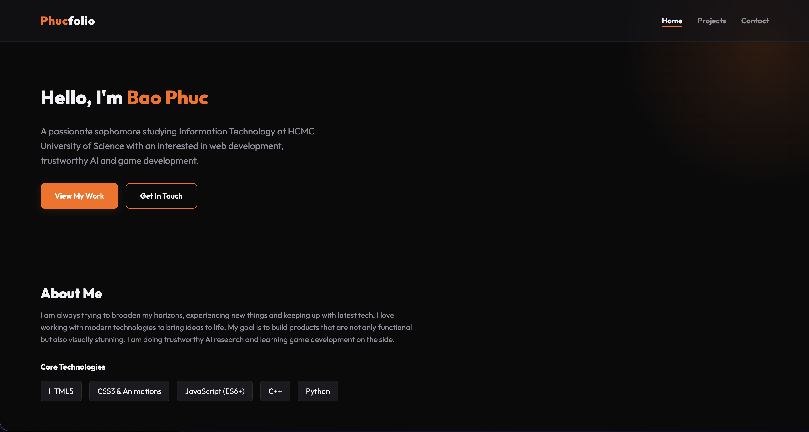

# Phucfolio 

My personal portfolio website showcasing my projects, skills, and background — built with a premium obsidian & orange aesthetic.

 **Live Site**: [phucfolio.vercel.app](https://phucfolio.vercel.app)



##  Features

- **Multi-Page Architecture** — Separate pages for Home, Projects, and Contact
- **Premium Dark Theme** — Obsidian background with orange/amber accent system
- **Glassmorphic Navbar** — Frosted glass effect with backdrop blur
- **Scroll Animations** — Fade-in effects powered by Intersection Observer
- **Project Filtering** — Filter projects by category (Web App, Game, Tool, Website)
- **Working Contact Form** — Integrated with [Formspree](https://formspree.io) for real email delivery
- **Responsive Design** — Fully optimized for mobile, tablet, and desktop
- **Smooth Hover Effects** — Project card lift animations and image zoom on hover

##  Tech Stack

| Technology | Purpose |
|---|---|
| **HTML5** | Semantic page structure |
| **Vanilla CSS** | Custom styling, animations, CSS variables |
| **Vanilla JavaScript** | DOM manipulation, form handling, scroll observer |
| **Vite** | Build tool & dev server |
| **Formspree** | Contact form backend |
| **Vercel** | Hosting & auto-deployment |

##  Getting Started

### Prerequisites
- [Node.js](https://nodejs.org/) (LTS version recommended)

### Installation

```bash
# Clone the repository
git clone https://github.com/NguyenPhucBaoPhuc/Phucfolio.git

# Navigate to the project
cd Phucfolio

# Install dependencies
npm install
```

### Development

```bash
# Start the local dev server
npm run dev
```

Open [http://localhost:5173](http://localhost:5173) in your browser.

### Production Build

```bash
# Build for production
npm run build

# Preview the production build
npm run preview
```

##  Project Structure

```
Phucfolio/
├── public/              # Static assets (project thumbnails)
├── src/
│   ├── style.css        # Shared design system & global styles
│   ├── projects.css     # Projects page specific styles
│   ├── home.js          # Home page scroll animations
│   ├── projects.js      # Project filtering logic
│   └── contact.js       # Contact form submission (Formspree)
├── index.html           # Home page
├── projects.html        # Projects page
├── contact.html         # Contact page
├── vite.config.js       # Vite multi-page configuration
└── package.json
```

##  Contact

Feel free to reach out via the [Contact page](https://phucfolio.vercel.app/contact.html) on the live site, or connect with me on [GitHub](https://github.com/NguyenPhucBaoPhuc).

---

Built with ☕ and 🧡 by **Bao Phuc**
